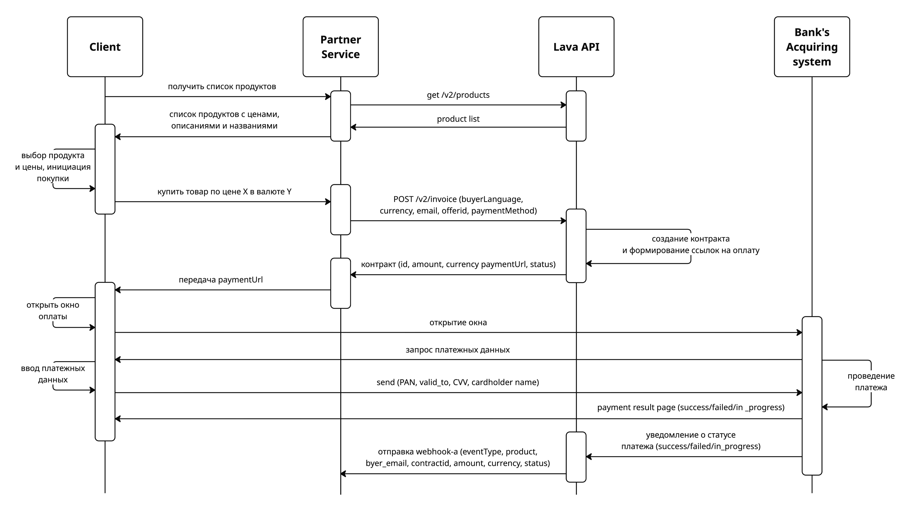

# Lava.top Payment Integration

## Overview
Модуль `lavatop/` реализует связку между нашим Telegram‑ботом и платёжной платформой Lava.top.
Теперь платежи идут по «официальной» схеме из документации Lava: бэкенд запрашивает список продуктов,
создаёт контракт через `/api/v2/invoice`, получает `paymentUrl` и возвращает его клиенту. Вебхук
`POST /api/miniapp/lava-webhook` принимает уведомления о статусе (success/failed/in_progress), начисляет
токены и уведомляет пользователя в Telegram.

> Полное описание REST API Lava находится в `documentation.yaml` (OpenAPI 3.0). Все поля/коды статусов,
> используемые здесь, берутся именно оттуда.

Основные файлы:

| Файл | Назначение |
|------|------------|
| `api.py` | Ninja API с публичными эндпоинтами (`create-payment`, `lava-webhook`, `payment-status`). |
| `provider.py` | Логика генерации платёжной ссылки: сначала через SDK, иначе fallback‑URL. |
| `webhook.py` | Парсинг payload'ов Lava (новый и legacy формат), подготовка унифицированных данных. |
| `config/products.json` | Каталог пакетов токенов и fallback‑ссылок. |
| `webapp/payment.html` | Мини‑страница для Telegram Mini App.

## Environment Variables
| Переменная | Описание |
|------------|----------|
| `LAVA_API_KEY` | API key из кабинета Lava; используется и как авторизационный заголовок для вебхука. |
| `LAVA_WEBHOOK_SECRET` | Секрет для Basic‑аутентификации вебхуков и подписи. |
| `LAVA_FALLBACK_CHAT_ID` | Telegram chat_id, которому начисляются токены, если вебхук пришёл без сопоставимой транзакции. Значение по умолчанию — `283738604`. |
| `PUBLIC_BASE_URL` | Базовый URL, который попадает в success/fail/hook ссылки при работе SDK/REST. |
| `LAVA_API_BASE_URL` | Базовый адрес API Lava (по умолчанию `https://gate.lava.top`). |
| `LAVATOP_RAILWAY_BASE_URL` / `LAVATOP_RAILWAY_WEBHOOK_URL` | Необязательные переменные для ручных тестов, по умолчанию указывают на production Railway.

## Webhook Configuration (Lava Cabinet)
* URL: `https://web-production-96df.up.railway.app/api/miniapp/lava-webhook`
* Event type: «Результат платежа»
* Вид авторизации: можно выбрать **Basic** (пароль = `LAVA_WEBHOOK_SECRET`). Если кабинет позволяет —
  также добавьте «API key вашего сервиса» (`LAVA_API_KEY`). Обработчик принимает любой из вариантов.

## Payment Flow

1. Клиент вызывает `/api/miniapp/create-payment` (`credits=100`, `amount=5`, `user_id=<telegram_id>`, дополнительно можно передать `payment_method` = `UNLIMINT`, `STRIPE`, `PAYPAL`, `BANK131`, `SMART_GLOCAL`, `PAY2ME`).
2. `create_payment` создает локальную транзакцию и вызывает `LavaProvider.create_payment`.
3. Провайдер делает `GET /api/v2/products`, находит нужный `offerId`, затем `POST /api/v2/invoice`
   (см. схему в документации). В ответ получаем `id` контракта и `paymentUrl`.
4. Полученный `paymentUrl` отдаём клиенту, а `id` сохраняем в `Transaction.payment_id`.
5. Клиент открывает платёжное окно Lava, вводит данные — Lava отправляет webhook на `/api/miniapp/lava-webhook`.
6. `lava_webhook` валидирует авторизацию, парсит payload и обновляет транзакцию:
   - `payment.success` / `subscription.*.success` → начисляем токены (`amount * 20`) и шлём уведомление в Telegram;
   - `payment.failed`, `subscription.*.failed`, `cancelled` → помечаем как неуспешный платёж;
   - неизвестные статусы → возвращаем `status: "unknown"`, чтобы Lava прекратила повторные попытки.

## Logs & Troubleshooting
* Успешный webhook → логи web‑сервиса содержат `Lava webhook received`, worker выдаёт
  `Payment <id> completed. Credited ... tokens`. Telegram уведомление появляется в чате fallback‑пользователя.
* Ошибка авторизации → статус 401 (`Invalid Lava webhook Authorization header` / `... API key header`).
* Если транзакция не найдена и fallback не настроен — статус 500 (`User not found for webhook`).

## Known Limitations
* Сторона Lava пока не возвращает продукты через SDK — используем статическую ссылку.
* Подписки не включены в продукте, но обработчик готов к событиям `subscription.*` (они не меняют существующие транзакции и не мешают продаже токенов).
* Балансы для тестов растут — периодически стоит обнулять записи `UserBalance` для fallback‑пользователя.

## Onboarding Checklist
1. Добавить в `.env` / Railway переменные `LAVA_API_KEY`, `LAVA_WEBHOOK_SECRET`, `LAVA_FALLBACK_CHAT_ID`.
2. Настроить webhook в Lava согласно разделу выше.
3. Убедиться, что fallback‑пользователь авторизовался в Telegram боте (иначе скрипты создадут запись автоматически). 
4. Выполнить ручную проверку: создать транзакцию через `/api/miniapp/create-payment`, затем отправить тестовый вебхук `POST /api/miniapp/lava-webhook` с корректной авторизацией и убедиться, что токены начисляются.
5. Проверить баланс и логи. После этого можно давать доступ пользователям.
